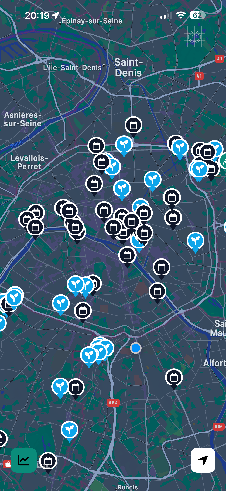
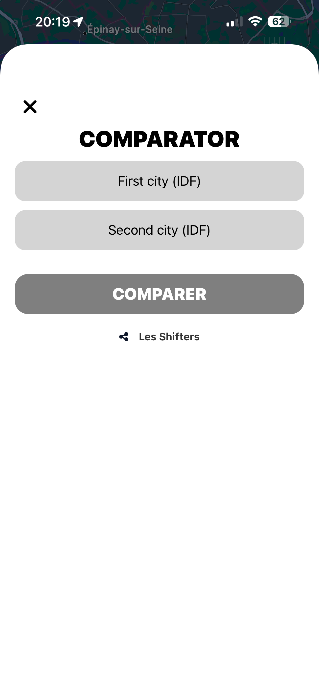
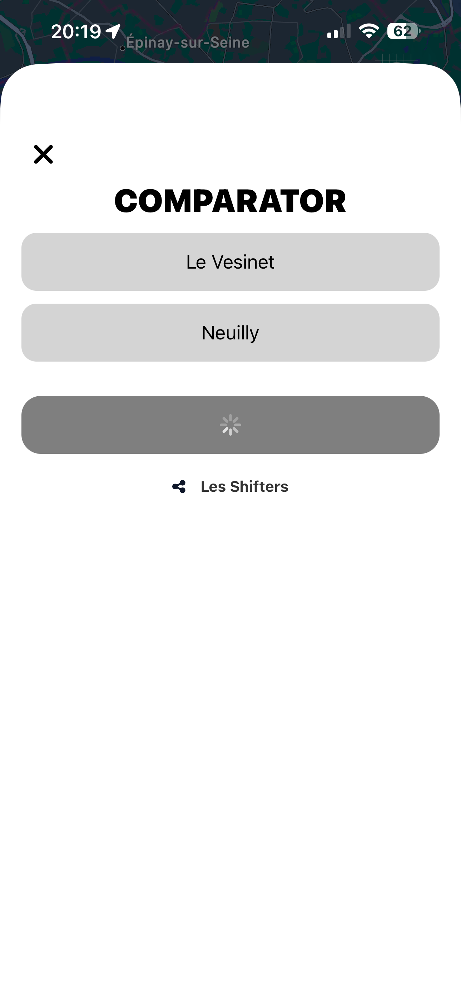
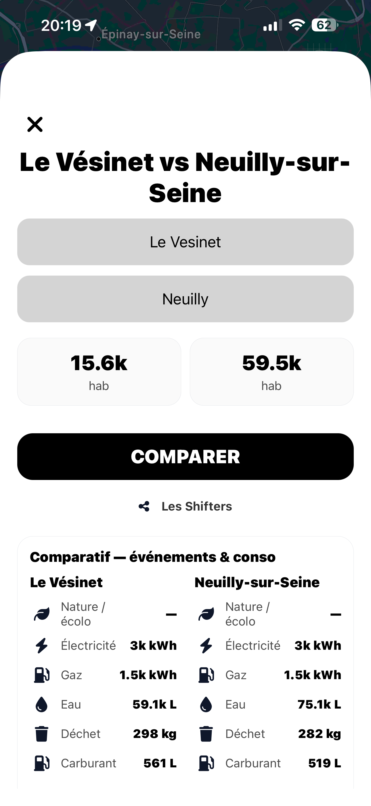
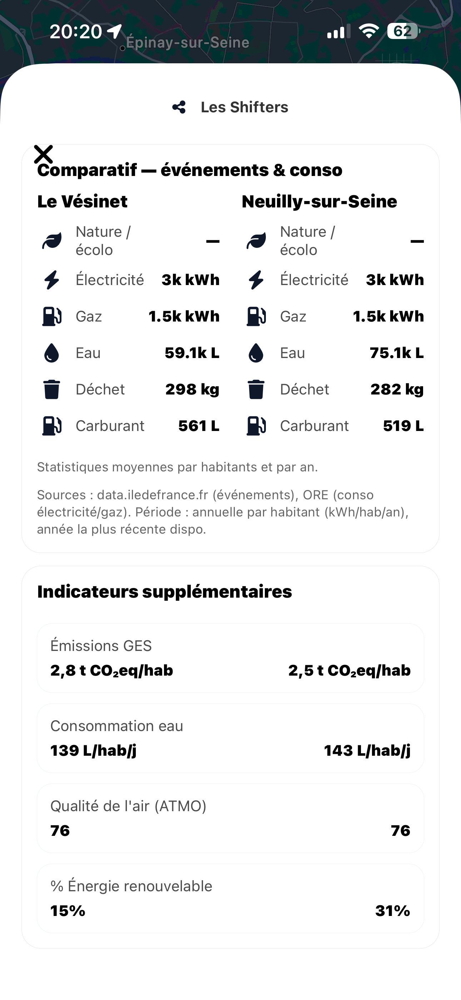

# 🌍 Eco-Go — Environmental Action Comparator for Municipalities

This project was created for the **Data & Climate** hackathon (Epitech × The Shifters) ahead of the 2026 municipal elections.
Goal: **measure, visualize, and compare** environmental actions of French municipalities (mobility, energy, sobriety, biodiversity, waste, etc.) using public data, and make them **easy to understand for citizens** through a clear and accessible interface.

## 📜 License

This code is published **for demonstration purposes only** as part of the hackathon.\
© 2026 — **All rights reserved**

## 🎯 Hackathon Objectives

- Identify and leverage **relevant data sources** (open data, institutional datasets, etc.)
- Structure and analyze the data to produce **comparable indicators**
- Design a **simple, educational, and accessible** interface
- Integrate **eco‑design** and digital sobriety principles

## 🧾 Credits

Project designed and developed by:

- **Simon Slack**\
    Email pro : simonjspslack@gmail.com\
    LinkedIn : linkedin.com/in/simon-slack\
    Github : github.com/Slacknsss
- **Raphael Leger**\
    Github : github.com/zzKew
- **Théo Busiris**\
    Email pro : contact@busiristheo.com\
    LinkedIn : linkedin.com/in/theobusiris\
    GitHub : github.com/MXXR-Fivem
- **Jules Fischer**\
    LinkedIn : linkedin.com/in/jules-fischer-1471602a1/\
    Github : github.com/Jules-Epitech

## ⚙️ Tech Stack

- **Expo / React Native**
- **Expo Router**
- **TypeScript**

## ▶️ Run Locally

1. Install dependencies

```
npm install
```

2. Start the app

```
npx expo start
```

3. Open the app

- **Expo Go** on mobile (QR code)
- **Web** in your browser
- **Android/iOS emulator** if installed

## 🧪 Data & Limitations

Indicators primarily come from open data sources (e.g., Île‑de‑France open data, ORE). When some data is unavailable, **estimates** may be used for demo purposes.

## 🔎 Preview






